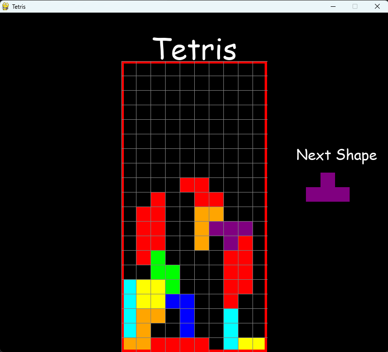

# Tetris - Pygame

This is a recreation of the game Tetris in Python using Pygame library!

# Screenshots

# Installation

 There are 2 ways, you can try this game yourself:
- download the latest release version of this repo
- clone this repo and run the main.py( you need to have Python and Pygame installed)

## Usage
Arrow keys are used to move the Tetris Pieces:

⬆️ - rotates the piece

⬅️ - moves the piece left by a block

➡️ - moves the piece right by a block

⬇️ - move the piece down by a block

## Contributing

Pull requests are welcome. For major changes, please open an issue first
to discuss what you would like to change.

Please make sure to update tests as appropriate.

## References

https://www.techwithtim.net/tutorials/game-development-with-python/tetris-pygame/tutorial-1
